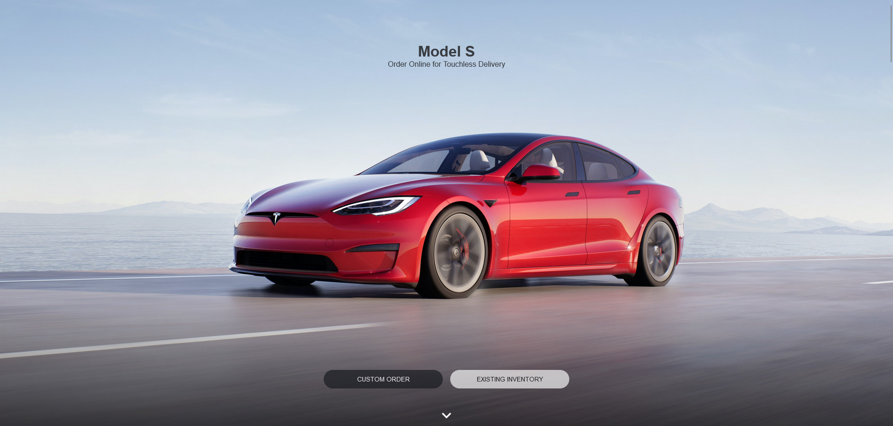

### `About This App`

Building any type of landing page using React is a good way to learn as a beginner. This project focuses more on building the UI and making it interactive. The landing page should have a navbar, a hero section, also other sections footer section and route of course.

This type of project shows that i'm comfortable with React and i can build good-looking landing pages .

### `View Demo`

[https://tesla-bd.netlify.app/](https://tesla-bd.netlify.app/)

### `App Screen Shot`
